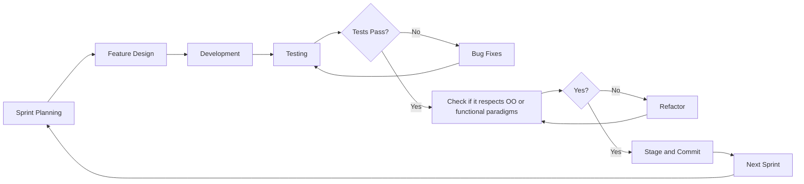
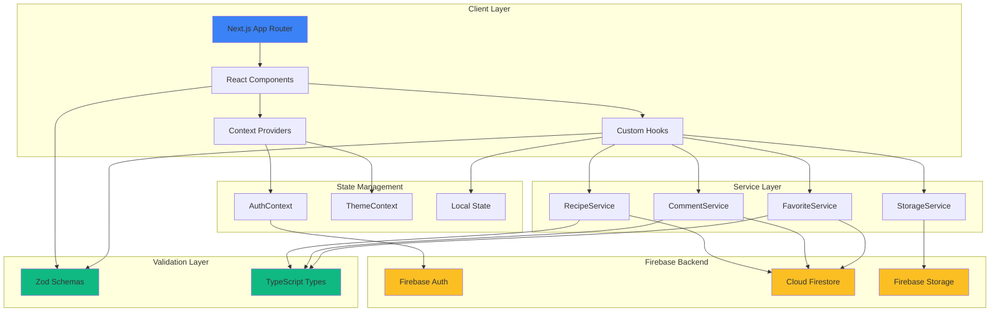

# PROJECT DOCUMENTATION

## General Presentation

The Recipe Platform is a full-stack web application designed to allow users to discover, create, share, and manage recipes. Built with Next.js 16 and Firebase, the application enables users to explore recipes, save favorites, and interact through comments and ratings. The platform provides a responsive interface with dark mode support, filtering functionality, and real-time data synchronization. Users can create recipes that include ingredients, preparation steps, dietary information, and images.

## Technical Objectives

The project was developed with the following objectives:

1. **React Architecture**: Use React 19 and the Next.js 16 App Router for routing and rendering
2. **Type Safety**: Enforce strict TypeScript typing across the codebase
3. **Serverless Backend**: Use Firebase Authentication, Firestore, and Storage
4. **Component Reusability**: Implement modular components following atomic design principles
5. **State Management**: Manage application state using React Context and custom hooks
6. **Form Validation**: Validate user input using Zod schemas
7. **Responsive Design**: Implement a mobile-first layout using Tailwind CSS v4
8. **Animation & UX**: Use Framer Motion for interface transitions
9. **Testing**: Implement unit and component tests with Vitest and Testing Library
10. **Security**: Apply Firebase authentication and authorization rules
    
## Functionalities

### Authentication & User Management
- Email and password registration
- Login and logout
- Password strength visual feedback
- Profile updates (name, photo, password)
- Account deletion with confirmation
- Protected routes for authenticated users

### Recipe Management
- Create recipes with:
  - Title, description, servings
  - Ingredients with quantities and units
  - Step-by-step instructions with optional images
  - Dietary options (vegetarian, vegan, gluten-free, etc.)
  - Difficulty and meal types
  - Active and passive cooking time ranges
  - Tags
- Edit and delete recipes (author only)
- Image upload with client-side compression
- Dynamic ingredient scaling based on servings

### Recipe Discovery & Filtering
- Paginated recipe listing
- Search by title, description, or tags
- Filtering by dietary options, difficulty, meal type, and tags
- Sorting by creation date, rating, number of reviews
- Active filter display with reset option

### Social Features
- Favorite recipes
- Favorites management
- Comments and ratings
- Display of average ratings and reviews
- Recipe author information

### User Interface Features
- Dark/light theme toggle with persistent storage
- Responsive navigation bar with search
- Loading indicators and empty states
- Toast notifications
- Confirmation modals
- Error boundaries
- Scroll-to-top control
- Image preview before upload

### User Dashboard
- List of user-created recipes
- Edit and delete actions
- Empty state for new users

## Technologies Used

### Frontend Framework & Libraries
- Next.js 16.0.10
- React 19.2.1
- TypeScript 5.9.3

### Styling & Animation
- Tailwind CSS 4.1.18
- Framer Motion 12.23.26
- React Icons 5.5.0

### Backend & Database
- Firebase 12.6.0
  - Authentication
  - Cloud Firestore
  - Firebase Storage
- Firebase Admin 13.6.0

### Data Validation & Type Safety
- Zod 4.1.13

### Testing
- Vitest 3.2.4

## Agile Methodology

### Development Sprints

The project followed an iterative Agile workflow:

#### ~Sprint~ Day 1: Account Features
#### ~Sprint~ Day 2: Basic UI/UX
#### ~Sprint~ Day 3 & 4: Recipe Features (CRUD, Favorites, Dashboard)
#### ~Sprint~ Day 5: Social Features (Comments, Replys, Ratings)
#### ~Sprint~ Day 6: Search & Filtering 
#### ~Sprint~ DAy 7-8: UI/UX Enhancements

### Development Flow



## App Architecture



## React Components Architecture

The application follows a modular component structure organized by feature and responsibility:

### Component Hierarchy

```
src/components/
├── Auth/                           # Authentication components
│   ├── AuthCard.tsx                # Card container for auth forms
│   ├── AuthMotion.tsx              # Animation wrapper for auth pages
│   ├── FormField.tsx               # Reusable form input field
│   ├── PasswordField.tsx           # Password input with toggle visibility
│   └── PasswordStrength.tsx        # Password strength indicator
│
├── Comments/                       # Recipe comments & ratings
│   ├── CommentForm.tsx             # Form to submit new comment
│   ├── CommentItem.tsx             # Individual comment display
│   ├── CommentsList.tsx            # List of comments
│   ├── CommentsRatings.tsx         # Combined comments and ratings view
│   ├── CommentsSection.tsx         # Complete comments section
│   ├── RatingDisplay.tsx           # Display average rating
│   └── StarRating.tsx              # Interactive star rating input
│
├── Dashboard/                      # User dashboard components
│   ├── DashboardHeader.tsx         # Dashboard page header
│   ├── EmptyDashboard.tsx          # Empty state for new users
│   └── RecipeGridWithActions.tsx   # Grid with edit/delete actions
│
├── ErrorBoundary/                  # Error handling components
│   ├── ErrorBoundary.tsx           # Base error boundary
│   ├── ComponentErrorBoundary.tsx  # Component-level errors
│   └── PageErrorBoundary.tsx # Page-level errors
│
├── FilterBar/                      # Recipe filtering components
│   ├── ActiveFiltersDisplay.tsx    # Show active filters
│   ├── DietaryFilter.tsx           # Dietary restriction filter
│   ├── DifficultySlider.tsx        # Difficulty level slider
│   ├── FilterBar.tsx               # Main filter bar container
│   ├── MealTypeFilter.tsx          # Meal type selector
│   └── SortButtons.tsx             # Sort options buttons
│
├── Navbar/                         # Navigation components
│   ├── Navbar.tsx                  # Main navigation bar
│   ├── NavbarActions.tsx           # User actions (login/profile)
│   ├── NavbarLogo.tsx              # Logo component
│   └── NavbarSearch.tsx            # Search input
│
├── Profile/                        # User profile components
│   ├── ProfileDangerZone.tsx       # Account deletion section
│   ├── ProfileNameSection.tsx      # Name update section
│   ├── ProfilePasswordSection.tsx  # Password change section
│   └── ProfilePhotoSection.tsx     # Profile photo upload
│
├── Recipe/                         # Recipe detail components
│   ├── RecipeBadges.tsx            # Dietary and difficulty badges
│   ├── RecipeDescription.tsx       # Recipe description display
│   ├── RecipeGrid.tsx              # Grid layout for recipes
│   ├── RecipeHeader.tsx            # Recipe title and metadata
│   ├── RecipeImage.tsx             # Recipe main image
│   ├── RecipeIngredients.tsx       # Ingredients list with scaling
│   ├── RecipeInstructions.tsx      # Step-by-step instructions
│   ├── RecipeNavigation.tsx        # Prev/next recipe navigation
│   └── RecipeStats.tsx             # Stats (rating, time, servings)
│
├── RecipeCard/                     # Recipe card components
│   ├── RecipeCard.tsx              # Main recipe card container
│   ├── RecipeCardBadges.tsx        # Card badges
│   ├── RecipeCardContent.tsx       # Card text content
│   ├── RecipeCardImage.tsx         # Card image
│   └── RecipeCardStats.tsx         # Card statistics
│
├── RecipeModal/                    # Recipe creation/edit modal
│   ├── BasicInfoForm.tsx           # Title, description, servings
│   ├── DietaryOptionsSelector.tsx  # Dietary checkboxes
│   ├── ImageUploadSection.tsx      # Image upload with preview
│   ├── IngredientsSection.tsx      # Ingredients input
│   ├── RecipeModal.tsx             # Main modal container
│   ├── RecipeModalHeader.tsx       # Modal header
│   ├── StepsSection.tsx            # Steps input
│   └── TimeInputSection.tsx        # Time range inputs
│
├── Tag/                            # Tag and badge components
│   ├── Tag.tsx                     # Generic tag component
│   └── CustomTags/
│       ├── DietaryBadge.tsx        # Dietary option badge
│       ├── DifficultyBadge.tsx     # Difficulty badge
│       └── RecipeTags.tsx          # Recipe tags display
│
├── UI/                             # Reusable UI components
│   ├── Button.tsx                  # Reusable button component
│   ├── ConfirmationModal.tsx       # Confirmation dialog
│   ├── EmptyState.tsx              # Empty state template
│   ├── ErrorMessage.tsx            # Error display
│   ├── LoadingSpinner.tsx          # Loading indicator
│   ├── PaginationControls.tsx      # Pagination buttons
│   ├── ScrollToTop.tsx             # Scroll to top button
│   └── Toast.tsx                   # Toast notification
│
├── ProtectedRoute.tsx              # Route protection HOC
└── ThemeToggle.tsx                 # Dark/light theme toggle
```

## API Documentation

### Serverless Architecture

This application uses a **fully serverless architecture** powered by Firebase services. There is no backend or REST API because the application communicates directly with Firebase services from the client:

#### Firebase Authentication
- **Purpose**: User authentication and session management
- **Operations**:
  - `createUserWithEmailAndPassword()`: Register new user
  - `signInWithEmailAndPassword()`: Login user
  - `signOut()`: Logout user
  - `updateProfile()`: Update user profile
  - `updatePassword()`: Change password
  - `deleteUser()`: Delete user account
  - `onAuthStateChanged()`: Listen to auth state changes

#### Cloud Firestore (Database)
- **Purpose**: NoSQL database for storing application data
- **Collections**:

  **recipes** Collection
  - **Document Structure**:
    ```typescript
    {
      id: string (auto-generated)
      title: string
      description?: string
      servings: number
      ingredients: Array<{name, quantity?, unit?, notes?}>
      steps: Array<{text, imageUrl?}>
      tags: string[]
      imageUrl?: string
      authorId: string
      authorName?: string
      createdAt: Timestamp
      avgRating?: number
      reviewCount?: number
      dietary: DietaryOption[]
      minActivePrepTime: number
      maxActivePrepTime: number
      minPassiveTime?: number
      maxPassiveTime?: number
      difficulty?: "easy" | "medium" | "hard"
      mealType?: string
    }
    ```
  - **Queries**:
    - List all recipes ordered by `createdAt`
    - Filter by `tags`, `difficulty`, `dietary` options
    - Get recipes by `authorId`
    - Search by title/description/ingredient/tags (client-side)

  **comments** Collection
  - **Document Structure**:
    ```typescript
    {
      id: string (auto-generated)
      recipeId: string
      userId: string
      userName: string
      userPhotoURL?: string
      text: string
      rating: number (1-5)
      createdAt: Timestamp
    }
    ```
  - **Queries**:
    - Get comments by `recipeId`
    - Calculate average rating per recipe

  **favorites** Collection
  - **Document Structure**:
    ```typescript
    {
      id: string (auto-generated)
      userId: string
      recipeId: string
      createdAt: Timestamp
    }
    ```
  - **Queries**:
    - Get favorites by `userId`
    - Check if recipe is favorited
    - Count favorites per recipe

#### Firebase Storage
- **Purpose**: Store and serve recipe images and profile photos
- **Buckets**:
  - `recipeImages/{recipeId}/{timestamp}`: Recipe images
  - `stepImages/{recipeId}/{stepIndex}/{timestamp}`: Step-by-step images
  - `profilePhotos/{userId}`: User profile photos
- **Operations**:
  - `uploadBytes()`: Upload image file
  - `getDownloadURL()`: Get public URL for image
  - `deleteObject()`: Delete image file

### Service Layer

The application implements a service layer to abstract Firebase operations:

- **RecipeService**: CRUD operations for recipes
  - `create(recipeData)`: Create new recipe
  - `getById(id)`: Fetch recipe by ID
  - `update(id, data)`: Update recipe
  - `delete(id)`: Delete recipe
  - `list(filters?)`: List recipes with optional filters
  - `getByAuthor(authorId)`: Get user's recipes
  - `search(searchTerm)`: Search recipes
  - `updateRatingStats(recipeId, avgRating, reviewCount)`: Update ratings

- **CommentService**: Manage comments and ratings
  - `create(commentData)`: Add comment/rating
  - `getByRecipeId(recipeId)`: Get recipe comments
  - `update(commentId, data)`: Update comment
  - `delete(commentId)`: Delete comment
  - `calculateAverageRating(recipeId)`: Calculate average rating

- **FavoriteService**: Handle favorite recipes
  - `add(userId, recipeId)`: Add to favorites
  - `remove(userId, recipeId)`: Remove from favorites
  - `getByUserId(userId)`: Get user's favorites
  - `isFavorited(userId, recipeId)`: Check favorite status

- **StorageService**: Image upload and management
  - `uploadRecipeImage(file, recipeId)`: Upload recipe image
  - `uploadStepImage(file, recipeId, stepIndex)`: Upload step image
  - `deleteImage(path)`: Delete image
  - `compressImage(file)`: Compress before upload

### Data Flow

1. **User Action** → Component event handler
2. **Component** → Custom hook (e.g., `useRecipes`, `useComments`)
3. **Custom Hook** → Service layer (e.g., `RecipeService.create()`)
4. **Service Layer** → Firebase SDK methods
5. **Firebase** → Cloud operations (Auth/Firestore/Storage)
6. **Response** → Service layer → Hook → Component state update
7. **Component** → Re-render with updated data

## Frontend Routes

| Route | Component | Description |
|-------|-----------|-------------|
| `/` | [page.tsx](src/app/page.tsx) | Home page with recipe grid, search, and filtering |
| `/login` | [login/page.tsx](src/app/login/page.tsx) | User login page with email/password authentication |
| `/register` | [register/page.tsx](src/app/register/page.tsx) | User registration page with password strength validation |
| `/recipes/[id]` | [recipes/[id]/page.tsx](src/app/recipes/[id]/page.tsx) | Individual recipe detail page with ingredients, steps, comments, and ratings |
| `/dashboard` | [dashboard/page.tsx](src/app/dashboard/page.tsx) | User dashboard showing personal recipes with edit/delete actions (protected) |
| `/favorites` | [favorites/page.tsx](src/app/favorites/page.tsx) | User's favorited recipes in grid layout (protected) |
| `/profile` | [profile/page.tsx](src/app/profile/page.tsx) | User profile management: name, photo, password, account deletion (protected) |

**Note**: Routes marked as "protected" require authentication. Unauthenticated users are redirected to `/login` via the `ProtectedRoute` component.

## Conclusions

Key achievements of CookHub include:

### Technical Accomplishments
1. **Serverless**
2. **Type-Safe**
3. **Modularity**
4. **Hooks**
5. **Unit Testing**

### User Experience Highlights
1. **Intuitive**
2. **Filtering**
3. **Real-time Updates**
4. **Smooth Animations**
5. **Dark Mode**

### Future Plans
1. **Search Enhancement**: Implement Algolia or Elasticsearch for full-text search capabilities
2. **Performance Optimization**: Add virtual scrolling for long lists, implement code splitting
3. **Social Features**: Enable user profiles, following system, and activity feeds
4. **Advanced Filtering**: "What's in my fridge?" ingredient-based recipe suggestions
5. **Gamification**: Add badges, achievements, and user progression system based on analytics;
6. **Offline Support**: Implement service workers for offline recipe access
7. **Admin Panel**: Create moderation tools for community management

### See it live:
[Vercel link](https://recipe-platform-pruo.vercel.app/)